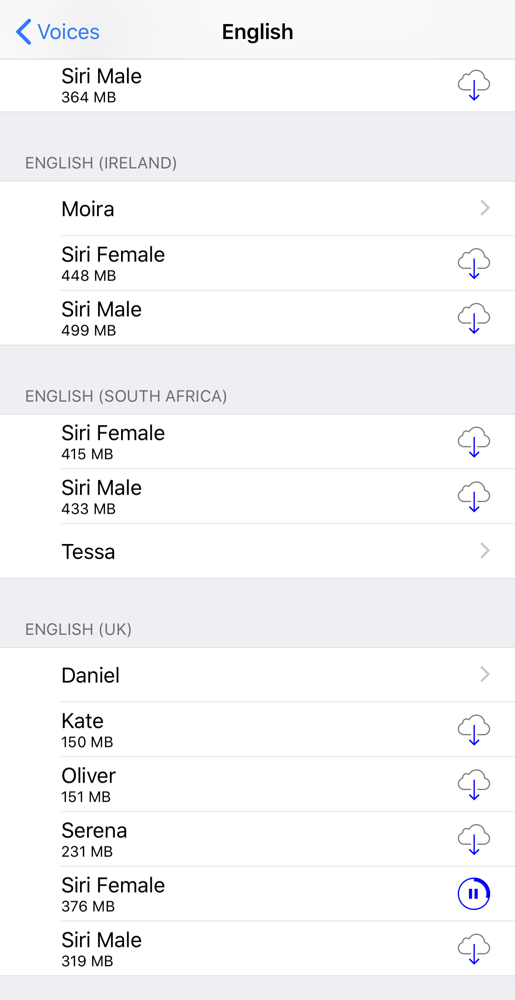

# This is how to have your books and articles read to you for free

### Siri just read an entire book to me. It's not a perfect solution, but I really like it.

From podcasting to audiobooks, it seems like audio is the new video, and over the last few years I have found that I am increasingly using audio as a way to learn. For me, it is great to have this option for these reasons:

* There are more ways I can listen to audio than I can watch video or read text. For example, I can listen while cooking, walking the dog, working out, and driving.
* I spend a lot of time on my computer all day anyway and inherited particularly bad myopia, so anything to ease strain on my eyes is a huge plus.
* I find that audio is better suited for a focused narrative than a screen as there are fewer distractions and links to divert my attention.

A growing number of apps and services are enabling audio dictation of text or even offer narration services. For example, Pocket will read your articles to you and Medium even offers members audio narrations of select stories. However, it is still the case that the space of interesting content available on written text is larger than that of pure audio and I would like that content dictated to me as well.

On my iPhone, I recently discovered that the text to speech service is getting quite good. Good enough to the point where sometimes I don't even realize the voice is synthetic. In this article, I will share a tip so that you can have _any_ content on your phone read to you regardless of whether the service offers text to speech functionality. While the approach I will show is specific to the iPhone, I wouldn't be surprised if there are similar analogs on Android and other platforms.

Here, I will show you how to configure your iPhone to read a book you own on Kindle. To be clear, it is not nearly as convenient as built-in functionality in an app like Pocket or Medium, but I have used it with pleasure so often that I can't help but to share.

First, under your settings app, click 'General' -&gt; 'Accessibility' -&gt; 'Speech'. Then, enable 'Speak Selection' and 'Speak Screen'.

You can also play with the speaking rate and with different voices. At the moment I prefer 'Siri', but there are a lot of interesting variants to choose from.

Finally, open the app that has content you want read, and make the text as small as you can so transitions between pages occur less frequently. Swipe down from the top with two fingers and the text will be read to you. You can control the speed and pause and resume playback from a floating box as well.

For the case of Kindle books, as long as my phone is not locked, it will continue reading the whole book, which is great. For other sites you may have to swipe down with two fingers for every new page, so it's not perfect, but I'm quite happy with it so far.

