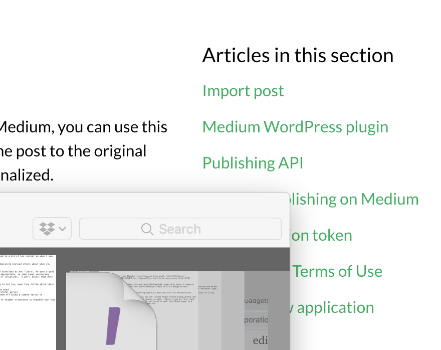

# Testing markdown to medium

The test here is from Github pages with an image.




## Trying another header

And testing that out.

> How about quotes?

Does that work well?


```python
def how_about_code:
    pass

if this_doesnt_work_blah:
    pass
```

